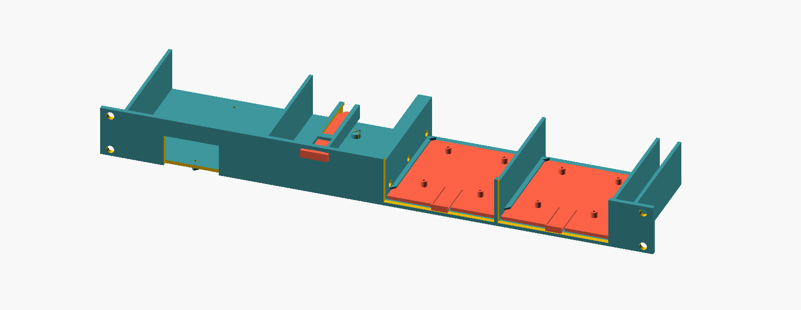
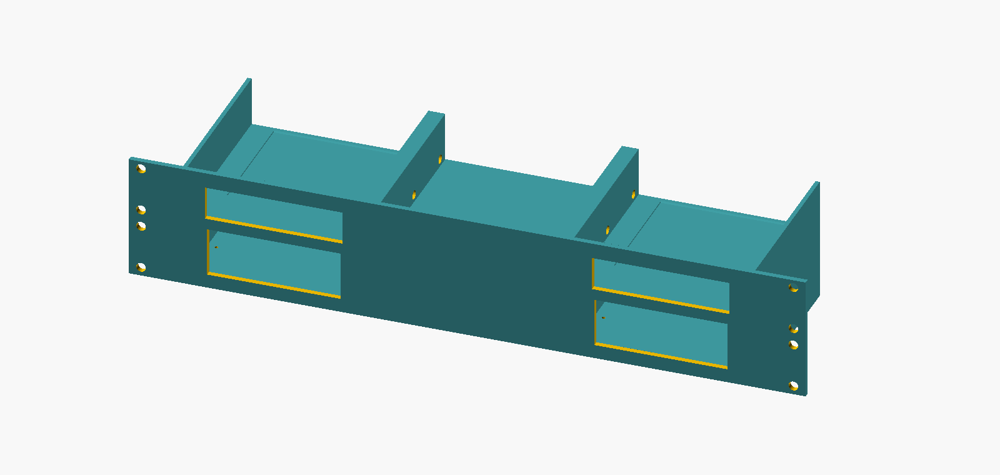
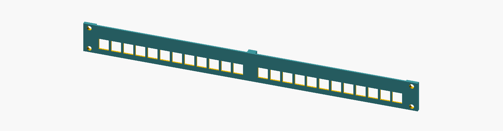

# rack-build — 3D-printed 19" rack panels

Three parametric OpenSCAD panels for a home 19" rack. Source files are in
`scad/`; the printable STLs are attached to each
[release](https://github.com/davidwkeith/rack-build/releases) rather than
kept in the repo. Printers: 2x Prusa i3 MK3S (250x210 mm bed).

**Test-first, every panel:** print the piece with a snap-fit or clip mechanism
first (right half of the 1U, column 1 of the 2U, one keystone piece) and
dry-fit the hardware before committing to a full print run. Several
mechanisms here are first-pass designs validated by geometry checks, not by
an actual print — see the cautions under each section.

---

## Print settings (all three files)

- **Material:** PETG
- **Orientation:** every panel piece prints with its front plate face-down on
  the bed (the .scad files handle this rotation automatically — just slice
  the STL as exported, don't reorient it in the slicer)
- **Supports:** none, for any piece. Stops, bosses and rail ends rise at 45
  degrees from the wall they grow out of, and the only overhangs left in
  the exported STLs are short bridges (12mm inside the Hue push-rod pier,
  16mm under the Pi sled, a 48mm strip of floor over the PoE window) and
  the tops of horizontal screw holes and pegs. A slicer's automatic
  supports will still build towers under every one of those holes, so
  leave supports switched off. This comes from measuring the STLs, not
  from a finished print.
- **Layer height / infill:** no hard requirement from the design; 0.2mm /
  15-20% infill is a reasonable default. Parts with threads cut directly
  into the plastic (standoffs, bosses) will hold a self-tapping screw better
  with higher infill in that specific region if your slicer supports it.

## Building

STLs are only generated by release builds: pushing a `v*` tag runs
[the release workflow](.github/workflows/release.yml), which exports every
piece and attaches the STLs to a GitHub release. To export them yourself
into `stl/` (ignored by git; needs `openscad` on your PATH):

```sh
./build.sh release
```

The preview images in this README are committed. After changing a source
file, re-render them with:

```sh
./build.sh
```

---

## Hardware shopping list (consolidated)

| Qty | Item | Used for |
|---|---|---|
| 18x | M3 x 8mm socket-head cap screw | Panel joints: 3 (1U Hue/Pi) + 12 (2U audio) + 3 (keystone) |
| 18x | M3 hex nut | Panel joints (nut traps) |
| 12x | 1.75mm filament offcuts, ~10mm long | Joint alignment dowels: 2 + 8 + 2 |
| 8x | M2.5 self-tapping screw | Raspberry Pi 5 to sled standoffs (4 per sled); not needed where a HAT's own standoffs do the job |
| 2x | M3 self-tapping screw | PoE++ bracket standoffs |
| 4x | M3 x 6mm pan-head self-tapping screw | Kinter MA170 tab mounting (2 per amp; 6x with a third zone). The tabs are 2mm, so the longest safe screw is 7mm; 6mm is the standard size that fits |
| 12x | M6 cage nut + screw | Rack ears, 4 per panel (the 2U has 8 holes; 4 is enough) |

Every joint is two 6mm flanges with a 3mm head recess on one side and a
2.8mm nut trap on the other, so an 8mm bolt ends inside the nut. A 10mm
bolt works too; it stands 1mm proud of the flange, clear of every device.

---

## 1. 1U — Hue Bridge + PoE++ injector + 2x Raspberry Pi 5

<picture>
  <source media="(prefers-color-scheme: dark)" srcset="images/rack-1u-hue-pi-dark.png">
  
</picture>

*Assembled, with the separately printed sleds, push-rod and pin in red.*

**Source:** `scad/rack-1u-hue-pi.scad`
**Pieces:** `rack-1u-left.stl`, `rack-1u-right.stl`, `rack-1u-sled.stl` (**print this one twice** — one per Pi), `rack-1u-pin.stl`, `rack-1u-rod.stl`

- **Left piece:** Philips Hue Bridge (model 3241312018) — front push-rod
  reaches the top sync button, two split snap-fit posts engage the Bridge's
  own keyhole + oval mounting slots. The UniFi PoE++ Adapter (60W) clips
  onto 2 printed standoffs on the floor's underside (92.80mm hole spacing,
  front-to-back) and hangs below the shelf; a 48x28mm front window keeps
  both port labels readable.
- **Right piece:** two Raspberry Pi 5 + PoE HAT sleds — one Home Assistant,
  one TBD. Each slides in from the front and latches via a flexing tongue
  riding a ratchet tooth, rather than lifting out from above (earthquake
  country — a Pi swap never needs the panel pulled from the rack). USB
  ports face front. The bays are sized for a Pi 5 under a
  [52Pi P30 PoE+ HAT](https://wiki.52pi.com/index.php?title=EP-0238), a
  ~30mm stack; that is tall enough that the bays are open at the top of the
  front plate rather than framed.

**Joint:** 3x M3 bolt + nut, 2x filament dowel, per half-to-half seam (one
seam total on this panel) = **3 bolts, 3 nuts, 2 dowels**.

**Assembly:**
1. Dry-fit one Pi sled into the right piece before printing a second — check
   the latch clicks in and lifting the pull lip releases it cleanly.
2. Bolt the two halves together while both are still empty: the bolt heads
   sit in the Hue bay and the nuts in the first Pi bay, and the Hue covers
   two of the three heads once it's in. Heads go in from the left piece's
   face, nuts tighten on the right piece's face. Seat the filament dowels
   first so the faces can't shift while you torque the bolts.
3. Push the Hue Bridge down into its left-piece pocket until the snap posts
   click; thread the push-rod and pin into the button-pusher channel from
   the front.
4. Screw the PoE++ adapter onto its 2 underside standoffs (M3 self-tap).
   **Check there's genuinely empty space in the rack slot directly below**
   — the adapter hangs ~31mm below the shelf floor.
5. Screw each Pi 5 onto its sled (4x M2.5 each, 8x total), USB/Ethernet
   toward the pull lip. If the HAT's standoffs have threaded studs, run
   those through the board into the sled's standoffs in place of the
   screws. Then slide both sleds into the right piece from the front until
   they latch. To pull one, lift the lip under the Pi's ports
   and draw the sled out by it.
6. Mount in the rack with M6 cage nuts.

**Open items** (all need the real hardware, not more modelling):
- **Needs calipers:** the Hue snap-post offsets are a photo estimate — if a
  post doesn't land in its slot, that's the first thing to re-check
  (`khole_dy` / `oval_dy`).
- **Needs a test fit:** the Pi + HAT height is 52Pi's published ~30mm, not
  a measurement. The model leaves it 2.7mm under the top of the 1U; set
  `pi_stack_h` if yours differs.
- **Needs a test print:** the Pi sled latch (flexing tongue + ratchet tooth)
  clears every interference check in the model but is untested as a
  physical mechanism. `ramp_h` in the .scad file is the knob to back off
  if the tooth grips too hard to release by hand.

---

## 2. 2U — Audio stacks (up to 3 AirPlay zones)

<picture>
  <source media="(prefers-color-scheme: dark)" srcset="images/rack-2u-audio-stacks-dark.png">
  
</picture>

**Source:** `scad/rack-2u-audio-stacks.scad`
**Pieces:** `audio-1.stl`, `audio-2.stl`, `audio-3.stl` (or `audio-2-stack.stl` in place of `audio-2.stl` for a third zone)

Three bolt-together columns. Each stack pairs one AirPort Express (upper U)
directly above one Kinter MA170 amp (lower U), one stack per AirPlay zone.

- **Columns 1 & 3 (zones 1 and 2):** AirPort rear-flush with a full-face front
  window + floor dimple; Kinter behind a 100 x 40mm window its knobs poke
  through (they stand 20mm proud of the front plate, for finger adjustment),
  with two printed screw bosses under the amp's factory mounting tabs.
  Front-to-back vent slots under the amp and in the upper floor ahead of the
  AirPort let its heat rise out of the stack. The amp
  floor sits 4mm up so those bosses stay inside the panel, and the AirPort
  floor sits 1mm above the amp rather than on the U line.
- **Column 2:** blank — the same floors and joints with no windows, dimple
  or bosses. For a third zone, print `audio-2-stack.stl` as the middle
  piece instead: it is the same stack as columns 1 and 3 and bolts up
  identically.

**Joint:** 2 seams (col 1-2, col 2-3), each 6x M3 bolt + nut (3 Y-positions x
2 Z-levels, one level per U) + 4x filament dowel = **12 bolts, 12 nuts, 8
dowels** total across both seams.

**Assembly:**
1. Print column 1 first and dry-fit an amp and an AirPort in it before
   printing the rest.
2. Bolt the empty columns together in order (1-2, then 2-3), dowels first,
   same as the 1U panel. The bolt heads and nuts sit inside the bays, so
   this has to happen before the amps go in.
3. Slide each Kinter MA170 into its lower U from the rear until its face
   meets the front plate, and screw it to the floor bosses through the
   amp's factory tabs. The two driver holes in the upper floor sit straight
   above the tab screws: lower each screw through on the driver.
4. Slide each AirPort Express into its upper U from the rear until it drops
   into the floor dimple. The driver holes stay clear either side of it, so
   an amp can come out without disturbing the AirPort.
5. Mount with M6 cage nuts — these columns carry protruding ear tabs that
   reach the rack's true 482.6mm width (the 3 columns' own content only
   spans 408mm).

**Open items:**
- **Tab screws:** the amp's tabs are 2mm, so the blind pilots (1mm skin
  under them) take a screw up to 7mm; M3 x 6mm gives about 4mm of grip.
- **Needs a test fit:** the amp bay is built from caliper measurements of
  one MA170 (103 x 70 x 43mm case, 124.5mm across the tabs, slots 113mm
  apart and 30-42mm behind the face) but hasn't been printed. Fit an amp
  to column 1 before printing the rest.

---

## 3. 1U — 24-port keystone patch panel

<picture>
  <source media="(prefers-color-scheme: dark)" srcset="images/rack-1u-keystone-panel-dark.png">
  
</picture>

**Source:** `scad/rack-1u-keystone-panel.scad`
**Pieces:** `keystone-left.stl`, `keystone-right.stl` (12 ports each)

Standard 14.5 x 16mm keystone cutouts, industry-standard across brands.
Panel's thinned to 2.5mm specifically so keystone clips can actually engage
(the rest of this rack's panels are 4mm — too thick for most keystone
jacks' spring clips to reach). Ports sit low in the panel, leaving ~20mm of
clear space above each one for a label.

**Joint:** 3x M3 bolt + nut, 2x filament dowel = **3 bolts, 3 nuts, 2
dowels**.

**Assembly:**
1. **Print one piece and test a single keystone jack before printing both**
   — clip tolerance varies enough by brand/model that this is worth
   confirming. If jacks won't seat, thin the panel further; if they're
   loose, that's likely fine (the clip still does the retaining).
2. Bolt the two pieces together same as the other panels (heads from the
   left piece, nuts on the right, dowels first).
3. Snap jacks in from the rear, terminated or not — they self-retain, no
   bracket needed behind the panel.
4. Mount with M6 cage nuts.

---

## Also in the rack

Two things in the rack aren't these panels:

- **Router:** the UCG Fiber and its power supply sit in the
  [UCG Fiber + PSU 19 inch modular rack mount](https://www.printables.com/model/1359874-ucg-fiber-psu-19-inch-modular-rack-mount)
  by [Maurício Pessoa](https://www.printables.com/@Mauker) on Printables,
  printed as published.
- **Switch:** a Ubiquiti EdgeSwitch 24 (ES-24-250W), a 1U unit that mounts
  on its own rack ears with no printed parts.

---

## Superseded / not included

- `rack-1u-kinter-amps.scad` — standalone single-amp panel, replaced by the
  2U audio stacks (each amp now pairs with its own AirPort Express instead).
- An earlier "keyhole" cable-management panel design was replaced entirely
  by the keystone panel above — no files from that version exist.

Both are left out of this collection since they're not part of the current
build.

---

## Credits

All geometry here is original, but two ideas came from other people's
models on Printables:

- The Hue button pusher follows RobinUit's "button pusher" (model 480200).
- The front-loading Pi sleds nod to JaredC01's "1U Rackmount Cluster"
  (model 285853).

The Hue snap-post spacing was cross-checked against vladimir.aubrecht's
remix (model 125408) of Luther2k's Hue rack mount.

## License

[ISC](LICENSE) © [David W. Keith](https://dwk.io)
